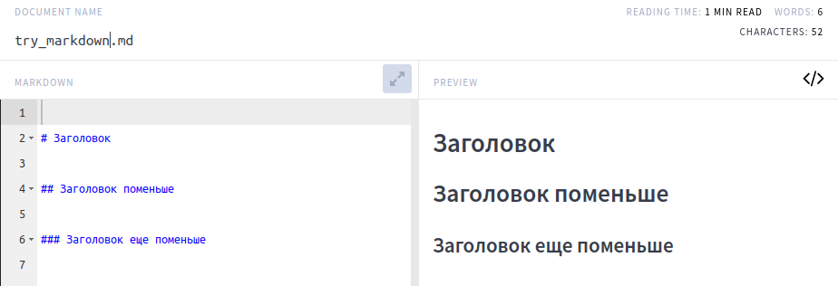
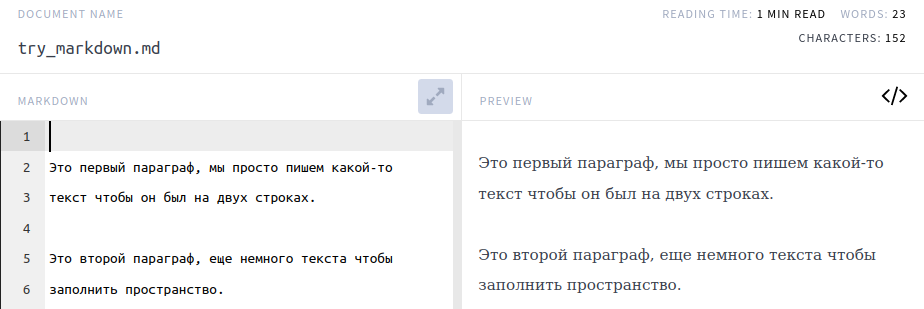
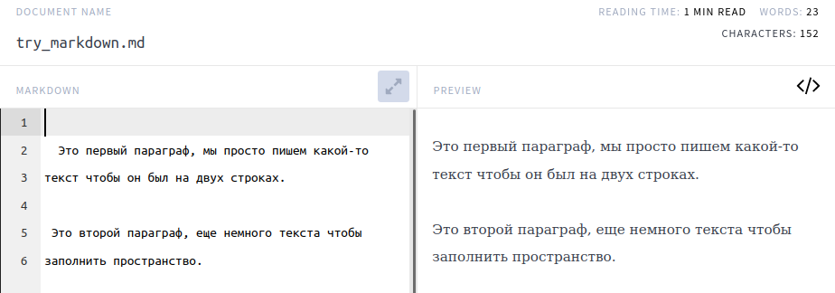
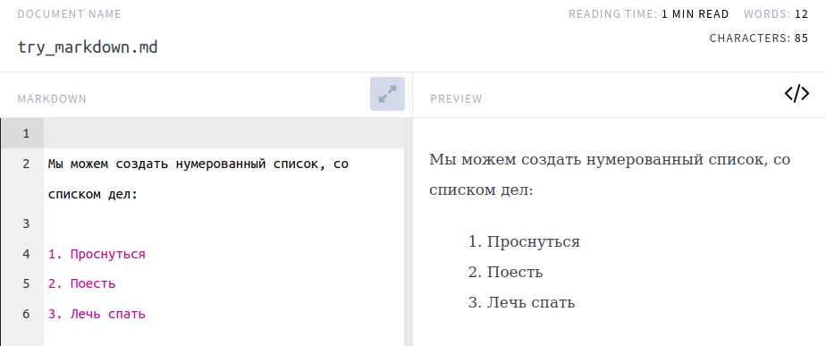
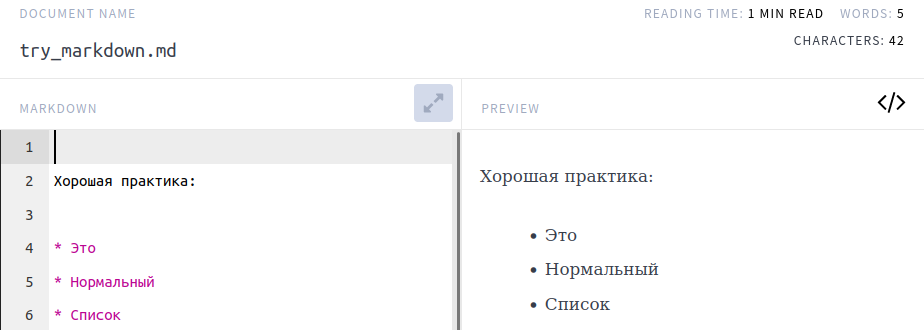
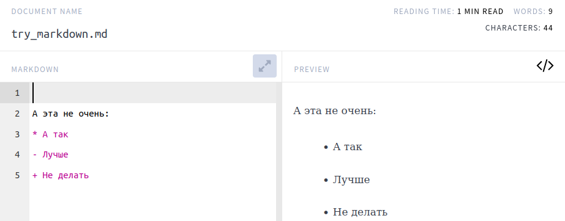
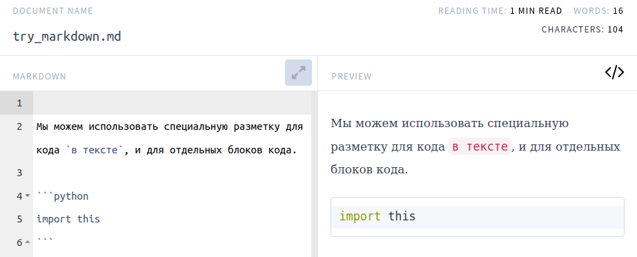

# Документирование

## Markdown

Когда мы писали свою простую библиотеку, мы делали файл README.md, содержимое которого собиралось в красивый [документ](https://github.com/standlab/mtracker/blob/main/README.md) самим GitHub. В этом случае мы использовали язык разметки `markdown`, который является одним из общепринятых способов оформления документации. Рассмотрим элементы разметки, в данном документе мы использовали [онлайн-редактор](https://dillinger.io/), но подойдет и любой другой. 

### Заголовки

Чтобы сделать текст заголовком, используйте один или несколько знаков решетки, чем их больше, тем меньше заголовок:



[Можно](https://www.markdownguide.org/basic-syntax/#alternate-syntax) обозначать заголовки через подчеркивания. **Хорошим тоном** считается отделение заголовка от текста выше и ниже, а также отделение знака решетки от: 

```
...какой-то текст до.

# Заголовок

Начало раздела...

```

### Абзацы

Чтобы в тексте начать новый абзац, разделите текст пустой строкой:


**Хорошим тоном** считается, когда мы пишем текст без отступов.

Так делаем:



А так нет:



Хотя результат будет один и тот же, мы всегда думаем не только о тех, кто читает собранный документ, но и о тех кто читает исходник. Различные отступы сильно затрудняют чтение.

### Форматирование текста

Текст можно делать жирным или курсивом:


Вместо звездочек можно использовать подчеркивания, но звездочки являются более универсальным способом выделения текста.

***Задание: как сделать шрифт жирным курсивом.***

### Cписки

В `markdown` можно делать нумерованный список или просто перечисление пунктов.



Мы можем использовать разные символы для ненумерованных списков (`-`, `*`, `+`), **хорошей практикой** является использование одного из них:



Не смешивайте несколько:



### Ссылки

Для того, чтобы вставить ссылку, пишем ее название в `[]` и после саму ссылку в `()`, название будет отображено в собранном документе:


Можно не вставлять ссылки в самом тексте, а вести их список отдельно и использовать id ссылки, там где нужно.


### Вставка изображений

Вставка изображений напоминает использование ссылок. Мы пишем текст, который будет показан вместо изображения, если оно не будет подгружено в `[]`, и указываем путь или ссылку на изображение. Вначале мы ставим восклицательный знак, а в круглых скобках можем указать всплывающую подсказку:

```

```


Если ошибиться в пути, будет показан текст из `[]`:

```

```


**Задание: проверьте, можно ли вести список картинок отдельными и вставлять их, используя id**

### Код

В случае необходимости процитировать в документации исходный код программы или его части используются специализированные форматированные блоки в которые помещаются фрагменты исходного кода программы. Это похоже на HTML-теги. Для создания блока кода в языке Markdown необходимо обрамить его символами \`\`\` код программы \`\`\`. Многие программмы поддерживают форматирование текста Markdown в соответствии стилю содержимого. Если мы оформим код программы, то в режиме просмотра его синтаксис будет подсвечиваться (как в среде разработке). Для лучшего распознавания стиля языка программирования следует указывать название языка или скрипта для применения подсветки его синтаксиса. Например, для представления фрагмента программы на языке Python лучше оформить его следующим образом: 

 \```python  
import os  
  
def foo():  
&nbsp;&nbsp;&nbsp;&nbsp;path = os.getcwd()  
&nbsp;&nbsp;&nbsp;&nbsp;print(f" Путь к текущей директории = {}\n\nСписок файлов:\n")  
&nbsp;&nbsp;&nbsp;&nbsp;rez = sorted(os.listdir(path)    
&nbsp;&nbsp;&nbsp;&nbsp;for n, item in enumerate(rez):  
&nbsp;&nbsp;&nbsp;&nbsp;&nbsp;&nbsp;&nbsp;&nbsp;print(n+1, item)  
\```

После того как вы откроете этот документ например в браузере, Вы увидите что код преобразился, его стиль изменился и стал больше похож на програмный код.  


``` python  
import os  

def foo():  
    path = os.getcwd()  
    print(f" Путь к текущей директории = {}\n\nСписок файлов:\n")  
    rez = sorted(os.listdir(path)    
    for n, item in enumerate(rez):  
        print(n+1, item)  
```



### Цитирование

В текст можно выставлять цитаты:


## reStructuredText

Сейчас будет неожиданно. Но дальше нам будет нужен другой язык разметки `reStructedText`. Для тех, кто потратил время на материал выше, будет [несложно](https://docs.open-mpi.org/en/v5.0.x/developers/rst-for-markdown-expats.html) освоить и `reStructedText`. Причины, по которым мы описали `Markdown` и затем предложили переключиться на `reStructedText`, две:

1. Курс написан с использованием `markdown`
2. Инструмент, который соберет документацию для нашего пакета и сделает из нее красивые `html`-страницы, работает с файлами `reStructuredText`

Вы можете изучить отличия чуть позже, сейчас мы возьмем open source [конвертер](https://github.com/miyakogi/m2r#sphinx-integration) `md` в `rst` и используем его. Для README это вполне рабочий вариант. Серьезную документацию лучше сразу писать в формате `rst`.

## sphinx

`sphinx` это достаточно мощный инструмент, который может собрать не только документацию к проекту и сделать из нее веб-страницы, которые мы можем потом разместить на [readthedocs](https://readthedocs.org/), но и текст для мануалов `man`, которые являются стандартным для `bash`.

**Обращайте внимание на то, в каких каталогах мы выполняем те или иные операции в `bash` во вставках кода ниже**

Создадим пустой каталог и перейдем в него, создадим каталог для документации в этой папке и заберем себе `README.md`:

```bash
(mtracker) artem@pc:~/tmp$ mkdir test_the_docs
(mtracker) artem@pc:~/tmp/test_the_docs$ cd test_the_docs
(mtracker) artem@pc:~/tmp/test_the_docs$ mkdir docs
(mtracker) artem@pc:~/tmp/test_the_docs$ wget https://raw.githubusercontent.com/standlab/mtracker/main/README.md
(mtracker) artem@pc:~/tmp/test_the_docs$ ls
docs  README.md 
```

Теперь установим `sphinx` и конвертер `rst -> md`, конвертируем README.md:

```bash
(mtracker) artem@pc:~/tmp/test_the_docs$ pip install sphinx
(mtracker) artem@pc:~/tmp/test_the_docs$ pip install m2r
(mtracker) artem@pc:~/tmp/test_the_docs$ m2r README.md
(mtracker) artem@pc:~/tmp/test_the_docs$ ls 
docs  README.md  README.rst
```

*Примечание: если бы у нас сразу был файл в формате, команды с `m2r` можно пропустить.*

Теперь мы готовы инициализировать каталог с документацией. 

```bash
(mtracker) artem@pc:~/tmp/test_the_docs$ cd docs
(mtracker) artem@pc:~/tmp/test_the_docs/docs$ sphinx-quickstart
(mtracker) artem@pc:~/tmp/test_the_docs/docs$ ls
build  make.bat  Makefile  source
```

На этом этапе вам будут заданы вопросы про название проекта, автора, версию и язык документации. На вопрос, разделять ли исходники и собранную документацию, отвечаем да:

```
> Separate source and build directories (y/n) [n]: y
```

Теперь зайдем в файл `nano ./source/index.rst` и добавим в конец строки:

```
Readme File
===========

.. include:: ../../README.rst
```
Это нужно для того, чтобы содержимое README было доступно в документации. *Мы пишем `../../` так как `README.rst` находится на два уровня выше, чем содержимое каталога `source`*. Теперь мы готовы собрать документацию:

```bash
(mtracker) artem@pc:~/tmp/test_the_docs/docs$ sphinx-build -b html source build
Running Sphinx v5.3.0
loading translations [ru]... готово
loading pickled environment... готово
building [mo]: targets for 0 po files that are out of date
building [html]: targets for 1 source files that are out of date
updating environment: 0 added, 1 changed, 0 removed
reading sources... [100%] index                                                  
looking for now-outdated files... none found
pickling environment... готово
checking consistency... готово
preparing documents... готово
writing output... [100%] index                                                   
generating indices... genindex готово
writing additional pages... search готово
copying static files... готово
copying extra files... готово
dumping search index in Russian (code: ru)... готово
dumping object inventory... готово
сборка завершена успешно.


(mtracker) artem@pc:~/tmp/test_the_docs/docs$ browse ./build/index.html
```

После этого должна открыться страница, на которой, кроме всего прочего, мы можем увидеть README.

